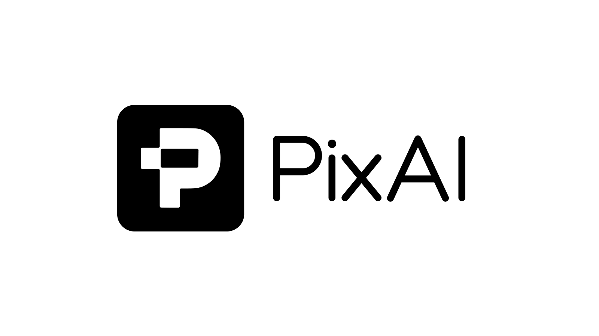

# Exhibit Creator

An internal web app for creating **art-book style exhibits of our model capabilities**, built on the [PixAI design system](.claude/skills/pixai-design/README.md).

Pick a language pair, compose pages of images with captions, and export the whole book as a landscape-A4 PDF.



## Features

- **Language pairing** — every exhibit declares an input → output language (English, 中文, 한국어, 日本語). The pair appears on the cover and on every page header of the export.
- **Cover & cover image** — title, subtitle, and a cover picked from the PixAI brand gradient, bundled key art, or your own upload.
- **Art-book pages** — each page has a title, up to 8 images, and a description per image. Images are arranged automatically into an editorial mosaic that fills the page (auto-cropped via `object-fit: cover`); layouts mirror on alternating pages so spreads feel designed, not repeated. Descriptions render as numbered plate captions along the bottom.
- **Book management** — add, delete, and reorder pages from the rail; live thumbnails; everything autosaves to IndexedDB in your browser.
- **PDF export** — one click renders the cover + every page to a landscape A4 PDF, pixel-identical to the preview (fonts, CJK text, and crops included).

## Running

```bash
npm install
npm run dev      # local dev server
npm run build    # typecheck + production build to dist/
```

No backend — exhibits are stored locally in the browser (IndexedDB). Uploaded images are resized to ≤1800px on import to keep storage and PDFs lean.

## Structure

```
public/
  brand/            PixAI logo, Mio mascot, key art (from the design system)
  fonts/            PixAI Rounded Light / Medium / Black
src/
  styles/tokens.css PixAI design tokens (colors, type, radii, shadows, motion)
  styles/global.css app + book-page styles built on the tokens
  lib/              data model, IndexedDB store, image import, mosaic layouts, PDF export
  components/       shared UI (buttons, chips, modal, pickers) + PageCanvas/CoverCanvas
  views/            Home (gallery + create) and Editor (rail / stage / inspector)
.claude/skills/pixai-design/   the full design-system bundle, installed as a Claude Code skill
```

## Design system

All colors, type, spacing, shadows and motion come from `src/styles/tokens.css` — the PixAI token layer (bright · anime-inspired · soft future tech). Body copy is Roboto; **PixAI Rounded** is reserved for the wordmark, page titles, and cover headlines. The signature gradient (`#9535EA → #EA79F1 → #FB7188`) marks primary/hero moments only.

Working on this repo with Claude Code? The `/pixai-design` skill loads the full brand guidelines.
